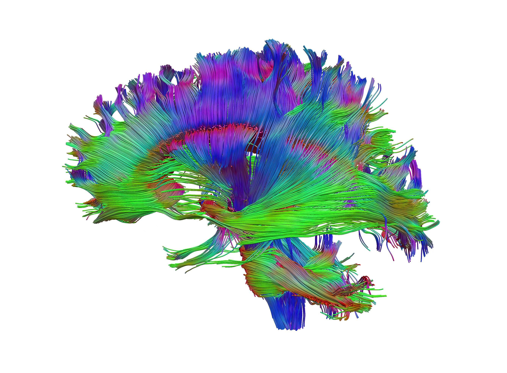
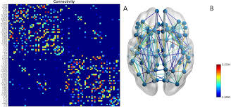
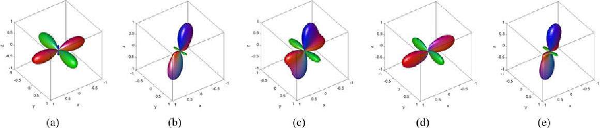

# **DWI Workshop**

**Graduate Student Workshop on Diffusion Weighted MRI imaging and data processing**

Arun Venkatarman, Zachary Christiensen, Alan Finkelstein 

Organized By: Madalina Tivarus & Lars Ross 

   
   

  

## Resources 

* [DIPY](https://dipy.org) : Data reconstruction (DTI, DKI, IVIM, Tractography) .
* [FSL](https://fsl.fmrib.ox.ac.uk/fsl/fslwiki/FDT/UserGuide):  Eddy correction (EDDY), Susceptibility correction (TOPUP), DTI, Tractography [FSL Diffusion Practical](https://fsl.fmrib.ox.ac.uk/fslcourse/2019_Beijing/lectures/FDT/fdt1.html)
* [MRtrix3](https://www.mrtrix.org/) : Reconstruction (CSD) + FBA, Tractrography + SC.
* [Brain Connecitivty Toolbox](https://sites.google.com/site/bctnet/): Graph Theory analysis of SC (FC).
* [Camino](http://camino.cs.ucl.ac.uk/) : Data Reconstruction + Synthesis + Tractography.

## References
1. [DTI Review - O'Donnell et al. 2012](https://www.ncbi.nlm.nih.gov/pmc/articles/PMC3163395/)
2. [NODDI -Zhang et al., 2012](https://www.sciencedirect.com/science/article/pii/S1053811912003539?via%3Dihub)
3. [Major White Matter Tracks - Bullock et al. 2022](https://psyarxiv.com/fvk5r/)
